# 科研流程协议 · Agent-Centric Research Protocol

> 📦 **这是打包出来的「开新项目」初始化文件夹**，由上游仓库的 `python3 tools/make_variant.py` 生成于 2026-09-01 15:57。
> 本目录**自包含、可整体拎走**：拷到别处 → `git init` → `bash tools/install_hooks.sh` → 用 Claude Code 打开，
> `bootstrap.md` 会带你走完初始化（选 A 新手 / B 老手）。
> 协议正文的唯一来源在上游根目录——**别在这里改协议**，改完上游重新生成即可。

> 一个 **Markdown 驱动 + Agent 主导** 的科研协作模板。
> 你给方向，Agent 跑实验，整个研究过程沉淀为可读、可复现、可多人协作的文档。

## 这是什么

- **模板仓库**：每个新研究项目从它实例化出独立 repo。
- **核心机制**：所有研究状态（idea / method / 议题 / 实验日志）都以 Markdown 落盘；Agent 负责重复执行，你专注高阶决策。
- **协议正文**：见 [`AGENTS.md`](AGENTS.md)（唯一来源）。

**四层记录，各管一件事**：

| 层 | 文件 | 回答的问题 |
|---|---|---|
| 主线 | `TIMELINE.md` | 走到哪了？怎么走到这里的？**有没有在绕圈子？** |
| 实验 | `LOGS/YYYY-Www.md` | 跑了什么？结论是什么？怎么复现？ |
| 过程 | `LOGS/YYYY-Www-activity.md` | 谁说了什么、Agent 做了什么（含用户原话） |
| 人话 | `idea.md § 7` | 讲给不懂这行的人（和三个月后的自己）听 |

## 谁应该用

- 一作 / PhD 学生：把 Agent 当协作者跑实验、做消融。
- 小团队 PI + 学生：用 `Discussion.md` 作为异步主战场，多人协作不丢上下文。
- 任何想让"半年后还能复现自己实验"的人。

## 怎么实例化一个新研究

```bash
# A. 从 GitHub 模板起步：点 "Use this template"，然后
git clone <your-new-repo-url> && cd <your-new-repo>

# B. 从打包好的初始化文件夹起步（不带上游的开发痕迹，可直接发给同学）
cp -R variants/research ~/my-research-X && cd ~/my-research-X && git init
#    如果你现在看着的就是那个拷出来的文件夹，跳过上面的 cp，直接 git init

# 之后两条路一样：
bash tools/install_hooks.sh    # 装 pre-commit 协议 lint

# 打开 Claude Code（或 Cursor / Codex）
#   会自动检测到 bootstrap.md，引导你选 A=新手 / B=老手 模式
#   选完后开始写你自己的 idea.md
```


## 关键文件一览

| 文件 | 作用 |
|---|---|
| `AGENTS.md` | 协议正文（必读） |
| `bootstrap.md` | 首次初始化向导（用完即删） |
| `idea.md` / `method.md` | 研究问题（§ 7 是人话版）/ 数学方法 |
| `TIMELINE.md` | 研发主线：节点表 + 自动生成的进度图 + 绕圈检测 |
| `Discussion.md` | 当前 active 议题（一议题一主线） |
| `LOGS/YYYY-Www.md` | 周实验日志 |
| `LOGS/YYYY-Www-activity.md` | 使用者 & Agent 流水（用户原话由 hook 自动记） |
| `code/` | 项目主代码（结构见 `code/README.md`） |
| `baseline/` | 对比 baseline（可选，结构见 `baseline/README.md`） |
| `ref/` | 论文 / 资料（默认不读，显式引用时必读） |
| `tools/` | 会话自检 / 周志 / 实验 / 议题 / 流水 / 时间线 / 人话版同步 / lint |

## 看得见的进度：主线图与绕圈检测

`TIMELINE.md` 里的图由 `python3 tools/timeline.py render` 从节点表生成——下面是一段**真在绕圈**的研究长什么样：

```mermaid
graph LR
  classDef question fill:#fff3bf,stroke:#b08900,color:#212529
  classDef hypothesis fill:#e7f5ff,stroke:#1971c2,color:#212529
  classDef experiment fill:#ebfbee,stroke:#2f9e44,color:#212529
  classDef decision fill:#d3f9d8,stroke:#0b7285,color:#212529
  classDef pivot fill:#ffe8cc,stroke:#e8590c,color:#212529
  classDef blocker fill:#ffe3e3,stroke:#c92a2a,color:#212529
  classDef note fill:#f1f3f5,stroke:#868e96,color:#212529
  classDef empty fill:#f8f9fa,stroke:#adb5bd,color:#868e96
  subgraph wk_2026_W10["2026-W10"]
    direction TB
    T_2026W10_001["❓ lr-schedule<br/>学习率调度是不是瓶颈"]:::question
    T_2026W10_002["🔬 lr-schedule<br/>cosine 比 step 收敛更快"]:::hypothesis
    T_2026W10_003["📊 lr-schedule<br/>cosine +1.2% 但方差大"]:::experiment
    T_2026W10_004["✅ lr-schedule<br/>主线采用 cosine + warmup"]:::decision
  end
  subgraph wk_2026_W12["2026-W12"]
    direction TB
    T_2026W12_001["❓ lr-schedule<br/>是不是该回去试 step decay"]:::question
    T_2026W12_002["🔬 lr-schedule<br/>step decay 在小 batch 更稳"]:::hypothesis
  end
  subgraph wk_2026_W13["2026-W13"]
    direction TB
    T_2026W13_001["📊 lr-schedule<br/>step decay 复跑"]:::experiment
    T_2026W13_002["🔬 lr-schedule<br/>也许是 warmup 长度的锅"]:::hypothesis
  end
  subgraph wk_2026_W14["2026-W14"]
    direction TB
    T_2026W14_001["📊 lr-schedule<br/>warmup 5%→10% 复跑"]:::experiment
    T_2026W14_002["🔬 lr-schedule<br/>回到 cosine 再试一次"]:::hypothesis
  end
  T_2026W10_001 --> T_2026W10_002
  T_2026W10_002 --> T_2026W10_003
  T_2026W10_003 --> T_2026W10_004
  T_2026W10_004 -. 重开 .-> T_2026W12_001
  T_2026W12_001 --> T_2026W12_002
  T_2026W12_002 --> T_2026W13_001
  T_2026W13_001 --> T_2026W13_002
  T_2026W13_002 --> T_2026W14_001
  T_2026W14_001 --> T_2026W14_002
```



- 每个方框是一个 ISO 周，从左到右就是进度；
- `2026-W10` 里「提问 → 假设 → 实验 → 拍板」是一条健康的主线；
- 那条虚线「重开」说明**已经拍过板的问题在两周后又被打开**，之后连跑三周没再拍出任何板——`tools/timeline.py check` 会机械报出来：

```
CIRCLE-2  lr-schedule：T-2026W10-004（decision）之后又出现 T-2026W12-001（question）——旧问题被重开
CIRCLE-1  lr-schedule：已尝试 3 轮仍无 decision——原地打转
CIRCLE-3  lr-schedule：未决节点已跨 3 个周——长期悬而未决
```

告警会出现在每次会话开头的简报里；`CIRCLE-2` 按协议 `§ 10` 要求 Agent **停下来问你**：是真有新证据，还是在绕圈？
（如果确实是有意转向，先记一个 `pivot` 节点——**绕圈与转向的唯一区别，是有没有人拍板承认自己在转**。）

## License

模板本身按需自选；衍生的科研仓库内容版权归各使用者所有。
